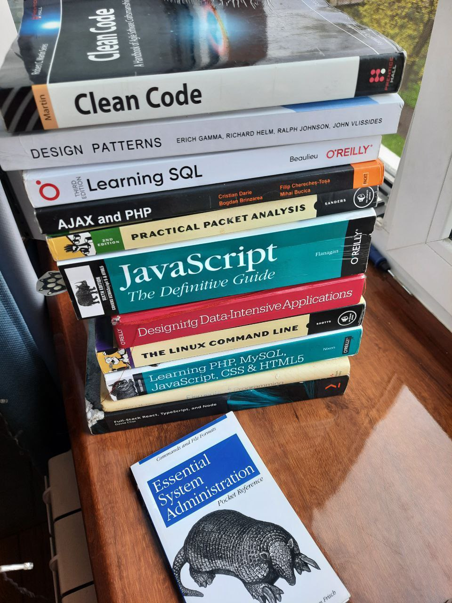

# 📚 Laravel my Books

Простое веб-приложение для управления коллекцией книг, созданное на Laravel с использованием чистого PHP и CSS.

##  Возможности

-  Просмотр списка всех книг
-  Добавление новых книг через форму
-  Валидация данных
-  Связь книг с категориями
-  Автоматическое заполнение тестовыми данными
-  Чистый код без лишних зависимостей


### Главная страница со списком книг, сократил до 10, но книг больше




## Технологии

- **Backend:** Laravel 10, PHP 8.0+
- **Frontend:** Чистый HTML, CSS (БЭМ методология, но я больше предпочитаю TailwindCSS)
- **База данных:** SQLite/MySQL
- **Без использования:** Bootstrap, jQuery, Docker, JS-фреймворков

- **мой предпочитаемый стек:**  Laravel, Inertia, Sail, React, Vite, TailwindCSS, Redis and MySQL (я знаю что PostgressSQL имеет больший функционал, но MySQl мне привычнее)

## 🛠️ Установка и запуск

### Требования
- PHP 8.0 или выше
- Composer
- SQLite (или MySQL но нужно будет поменять в database.php)

### Шаг 1: Клонирование репозитория
```bash
git clone https://github.com/Wasuremeno/BaltPoint.git
cd BaltPoint
php artisan migrate:fresh --seed
php artisan serve
